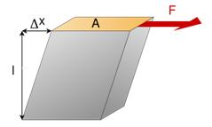

## Theory 

Shear modulus, or rigidity modulus n is defined as the ratio of stress F/A to strain $$\Delta x$$/l when a shearing force F is applied to a rigid block of height l and area A. $$\Delta x$$ is the deformation of the block, and

  

This is similar to what happens when a torque $$\tau $$ is applied to a rigid rod of length l and radius r. Looking at the cross-section of the rod, consider a ring of width dr' at radius r' , which will have area $$2\pi r'dr' $$, with force applied tangentially. The weighted average force over the cross-sectional area A of the rod is then

$$\frac{1}{A}\int_{0}^{r}\frac{\tau}{r'}2\pi r'dr'=\frac{1}{\pi r^{2}}2\pi r\tau = \frac{2\tau}{r}........(2) $$

If the torque deforms the rod by twisting it through a small angle $$ \Theta$$, the deformation distance (corresponding to $$\Delta x$$ ) at the outside edge of the rod is approximately  $$2\pi r $$. The definition of the rigidity modulus n becomes 

$$ n=\frac{F/A}{\Delta x/l}=\frac{\frac{2\tau}{r}/\pi r^{2}}{\theta r/l}=\frac{2\tau l}{\pi r^{4}\theta} .......(3) $$

In our apparatus the torque $$ \tau $$ is supplied by hanging a weight of mass M from a string wound round a pulley of radius R, so $$ \tau$$ =MgR and our definition of rigidity modulus n becomes   

$$ n=\frac{2MgR}{\pi r^{4}}\frac{l}{\theta}.......(4) $$

Now suppose we mount a small mirror on the rod at distance l from its fixed end, and look at a centimeter scale in the mirror through an adjacent telescope, both at distance D from the mirror. When the rod deforms and the mirror rotates through a small angle $$ \theta $$, we look at a point on the scale a distance approximately $$ S=2D\theta $$¸ from the original point, which was aligned with the telescope. We can measure D and S and substitute $$ \theta $$¸ =S/2D in our definition of rigidity modulus n, to get 
